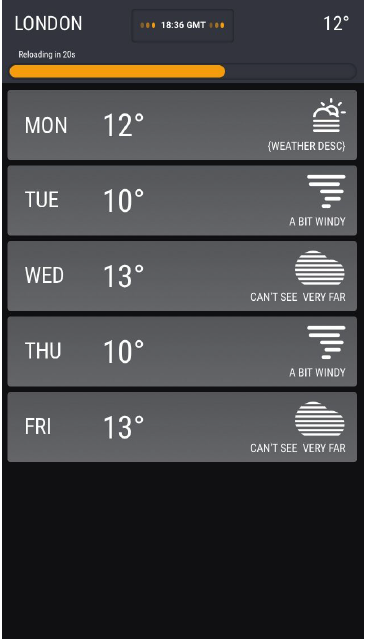

# Weather Application

This weather app displays the current weather in London and weather forecasts for the next 5 days. It will load this information when it opens and then refresh the information every minute.
The counter and progress bar will visualise time to next refresh.

Weather information for the application is obtained from the [Open Weather Api]("https://openweathermap.org/api").

In order to run the application you will need to register to use this service and obtain an API Key.

## Running the application

To run the application please:

1. Download or clone the repository
2. cd to the repository directory in terminal
3. type "npm install" and press enter. This will install the package dependencies for the app.
4. Create a .env file by typing "touch .env"
5. type 'echo "REACT_APP_API_KEY=YOUR_API_KEY" > .env'
   Please replace "YOUR_API_KEY" with your API KEY.
6. type "npm start" and press enter to start the application.

# Repository folder structure

## Prototype

This contains the prototype for a weather application.

The prototype folder contains two files:

- proto.html
- proto.css

These contain the HTML and CSS for a mock-up of the design below:

# Src/Components

## Header

## Progress Bar

## API Fetch

## Weather display

## Clockface

## API Calls

We need two API calls

1. For the current weather to the /current endpoint
2. For the forecast to the /forecast endpoint

I have used two separate functions to test the API calls
each take the city id and api key as parameters.

To hide the API key from being seen I am using REACT_APP environment variables for both (in the .env root file).

To ensure that these are populated when I call the API endpoints I hook them with useEffect which runs after these variables have populated (and rendering is complete).

# Functional testing (manual)

1. Front end design is as required

2. Both API calls are returning valid data.

# Future improvements

1. Full Testing using Jest and Enzyme.
2. If the app continues to grow or more functionality is required it could be refactored to use Context for state management (or Redux).
3. As the app looks like a mobile application we could make it fully mobile using a framework like [Ionic]("https://ionicframework.com/").
